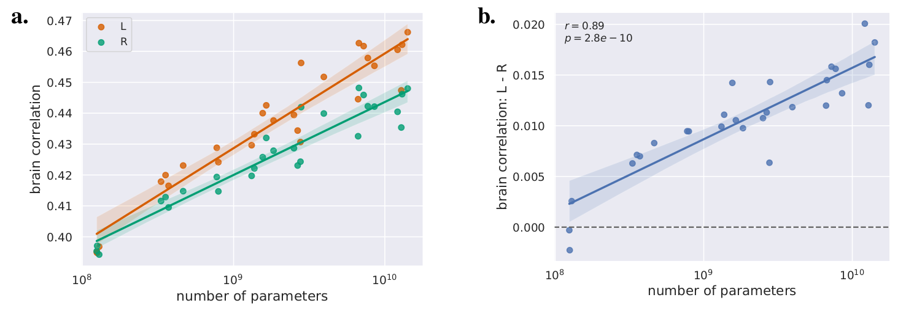

# Source code for "fMRI predictors based on language models of increasing complexity recover brain left lateralization"
by Laurent Bonnasse-Gahot and Christophe Pallier

## Dependencies

### Python modules

See `requirements.txt` for the full list of packages used in this work. This file provides the exact version that was used, but the code is expected to work with other versions as well.

It is recommended to create a virtual environment to install the python modules, for example:

With Anaconda

    conda create --name lpp python=3.10
    conda activate lpp
    pip install -r requirements.txt

Or with Pyenv

    pyenv virtualenv 3.12.0 lpp
    pyenv activate lpp
    pip install -r requirements.txt

Once the environment is installed, you can launch `jupyter notebook` or `jupyter lab` to execute the python files (`.py`) or the notebooks (`.ipynb`) with the `%run` command.

### fMRI data

Ref: Li, J., Bhattasali, S., Zhang, S., Franzluebbers, B., Luh, W., Spreng, R. N., Brennen, J., Yang, Y., Pallier, C., & Hale, J. (2022). **Le Petit Prince multilingual naturalistic fMRI corpus**. _Scientific Data_, 9, 530.

The fMRI data can be obtained at openneuro.org: [doi:10.18112/openneuro.ds003643.v2.0.1](https://doi.org/10.18112/openneuro.ds003643.v2.0.1).

You will only need the `annotation/EN` and `derivatives/sub-EN*` subfolders.

### Glove embeddings

Download the _GloVe embeddings_:

	wget https://huggingface.co/stanfordnlp/glove/resolve/main/glove.6B.zip
	unzip glove.6B.zip

## Setting up paths and hugginface access_token

First, you must set all folders variable (at least `home_folder` and `lpp_path`) in [llms_brain_lateralization.py](llms_brain_lateralization.py).

In the same file, you should provide a valid `acces_token` in order to be able to access the various models in huggingface that require authentication.

## Processing pipeline

1. Resample fMRI data to 4x4x4mm voxels:

        python resample_fmri_data.py

2. Create a mask common to all subjects:

   %run [compute_mask.ipynb](compute_mask.ipynb)

   to generate `mask_lpp_en.nii.gz`

3. Compute the average subject

   %run [compute_average_subject_fmri.ipynb](compute_average_subject_fmri.ipynb)

   This notebook also computes an evaluation of the inter-subjects reliable voxels and produces `corr_group_split_10trials.gz` which contains, for each voxel, the correlation between an average subject made from half of the subjects and predicted values from held-out runs using another average subject made from the other half of the subjects as regressors (and this 10 times, using different group partitions).

4. Extract activations from LLMs.

        python extract_llm_activations.py --model XXX

   to get output of the neurons of each layer of model `XXX`; for instance, for `gpt2`:

        python extract_llm_activations.py --model gpt2

   In order to extract from the all models, one can use the following bash lines:

        while read -r model_name; do
            python extract_llm_activations.py --model $model_name
        done < model_list

5. Fit the average fMRI subject using ridge regression. Run the script `fit_average_subject.py`. For instance, using the activations from gpt2 as extracted in the previous step, run `python fit_average_subject.py --model gpt2`. In the paper, the whole model list described above is used, as follows (in bash):

        while read -r model_name; do
            python fit_average_subject.py --model $model_name
         done < model_list

6. Compute the baselines (random vectors, random embeddings and GloVe).

    For GloVe, first download the [GloVe embeddings](https://nlp.stanford.edu/projects/glove/). Then run

	    python extract_glove_activations.py

	to extract the embeddings, then

	    python fit_average_subject.py --model glove

	to fit to the fMRI brain data.

    For the random baselines, use `generate_random_activations.py`. The paper uses the following bash code:

        for type in vector embedding
        do
            for d in 300 1024
            do
                for i in {1..10}
                do
                      python generate_random_activations.py --type $type --n_dims $d --seed $i;
                      python fit_average_subject.py --model random_${type}_${d}d_seed$i;
                done
            done
        done

7. Analyze and visualize all the results, as described in the paper:

   %run [analyze_results.ipynb](analyze_results.ipynb)

## Preprint

[arXiv:2405.17992](http://arxiv.org/abs/2405.17992)
